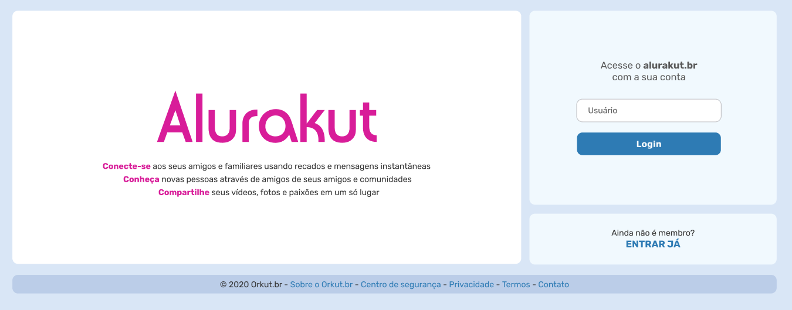
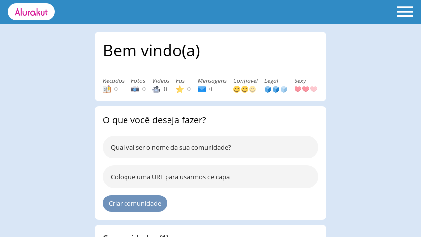

  
   
  <h4>Projeto realizado na imersão React da <a href="https://www.alura.com.br/" target="_blank">Alura</a>.</h4>
   
  <h2><a href="https://alurakut-gabrlcj.vercel.app/" target="_blank">Site da aplicação</a></h2>

---

  <b>
    <a href="#sobre">Sobre</a> |
    <a href="#imagens">Imagens</a> |
    <a href="#tecnologias">Tecnologias</a> |
    <a href="#licença">Licença</a> |
    <a href="#autor">Autor</a>
  </b>

---

## Sobre
**Nesta imersão da [Alura](https://github.com/alura-challenges) nós revivemos o nossa querida rede social Orkut, ou quase isso hahaha, com algumas mudanças utilizamos das novas tecnologias para recriar a interface dele.**

**Dentro de 5 dias com utilização de React.js e Next.js nosso objetivo é transformar ela em uma aplicação focada em *SPA* ou *Single Page Application*.**

 

## Imagens

  <h5>Página de Login(ainda em contrução):</h5>
  
  <h5>Menu mobile da Home:</h5>
  

---

## Tecnologias
### *Linguagens:*
 - JavaScript
  
#### *Bibliotecas / Frameworks:*
  - [Next.js](https://nextjs.org/)
  - [React.js](https://pt-br.reactjs.org/)

#### *Utilitarios:*
 - [Yarn](https://yarnpkg.com/)

## Licença

### Instrutores:
**Aqui um agradecimento pelos instrutores dessa imersão incrivel que a Alura sempre proporciona!!!**

 - [MarioSouto](https://github.com/omariosouto)

 - [PauloSilveira](https://github.com/peas)

 - [JulianaNegreiros](https://github.com/juunegreiros)

## Autor

<b>Gabriel Bittencourt Penteado 🔰</b>

Feito com 🤎 por Gabriel B. Penteado. Entre em contato! 👋🏽

